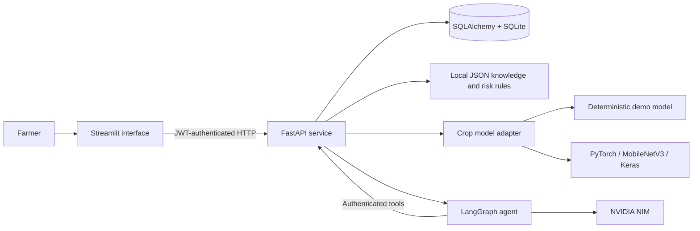

# AgriVision AI

> **One farmer, one application — complete crop and livestock health visibility.**

AgriVision AI is a local-first farm health platform that combines crop disease screening, practical advisories, livestock health monitoring, vaccination reminders, farm records, alerts, analytics, and an agentic AI assistant in one farmer-friendly application.

[](https://www.python.org/)
[](https://fastapi.tiangolo.com/)
[](https://streamlit.io/)
[](#testing)

## The problem

Small and marginal farmers often manage crop health, animal health, vaccination schedules, and farm records through disconnected tools or paper notes. Specialist help may not be immediately available, internet connectivity may be unreliable, and early warning signs can be missed.

AgriVision AI brings these workflows together without pretending that AI replaces an agricultural officer or veterinarian. It provides preliminary screening, explainable risk indicators, practical next steps, and clear escalation guidance.

## The solution at a glance

| Farmer need | AgriVision AI response |
|---|---|
| Identify a crop problem quickly | Validated leaf-image upload, top-three predictions, confidence, severity, and contextual advice |
| Avoid incorrect image predictions | Confidence- and entropy-based out-of-distribution detection for real models |
| Know when an animal needs attention | Explainable, JSON-driven health-risk scoring from symptoms and observations |
| Never miss animal-care tasks | Vaccination timeline, due/overdue status, reminders, and alerts |
| Keep farm information in one place | Secure farms, crop cycles, livestock, diagnoses, observations, and medical records |
| Ask questions naturally | NVIDIA NIM + LangGraph assistant that reads and updates records through authenticated tools |
| Work with limited connectivity | Local SQLite storage, local knowledge rules, and local crop inference; only the AI assistant requires NIM access |
| Support regional users | English and Hindi interfaces, Tamil navigation support, and language-aware assistant responses |

## Key features

### Crop intelligence

- JPG, JPEG, and PNG validation with an 8 MB upload limit
- Local image resizing, compression, randomized filenames, and safe storage
- 38 disease/healthy output classes covering 14 crop families
- Top-three predictions with confidence-aware wording
- Out-of-distribution detection using confidence and prediction entropy
- Crop- and growth-stage-aware recommendations from a local JSON knowledge base
- Diagnosis history, repeated-issue alerts, and expert-escalation guidance
- Replaceable mock, PyTorch, MobileNetV3, and Keras model adapters

Supported crop families: **Apple, Bell Pepper, Blueberry, Cherry, Corn, Grape, Orange, Peach, Potato, Raspberry, Soybean, Squash, Strawberry, and Tomato.**

### Livestock health

- Livestock registry with unique tag IDs and farm association
- Health observations for temperature, appetite, activity, respiration, injuries, and other symptoms
- Explainable low/moderate/high risk scores driven by editable rules
- Automatic warning or critical alerts for concerning observations
- Medical-record timeline and vaccination history
- Due-soon and overdue vaccination tracking across all animals

### Agentic farm assistant

- Natural-language access to farm, crop, livestock, diagnosis, vaccination, and alert data
- 24 read/write tools executed through the application's authenticated REST API
- Multi-step LangGraph planner with NVIDIA NIM structured output
- User-scoped conversational memory and bearer-token authorization
- Safe mutation behavior: the assistant resolves record IDs before writes and requires exact confirmation for deletion
- Optional crop-image attachment for quick analysis or explicit persistence to a crop record
- English, Hindi, and Tamil response instructions

Example requests:

```text
Which animals need attention and what should I do next?
Show every vaccination that is due.
Add a 0.75 acre tomato crop at Green Valley Farm, seedling stage.
Record Lakshmi's temperature as 40.2 C with low appetite and low activity.
Analyze this crop image, but do not save it.
Save this diagnosis to Green Valley Farm's tomato crop.
```

### Farm operations and insights

- Secure registration and sign-in with JWT-based authorization
- Multiple farms and crop cycles per farmer
- Dashboard KPIs, recent diagnoses, upcoming animal-care tasks, alerts, and Plotly charts
- Create, update, and confirmed-delete workflows with ownership checks
- Automatic cascading cleanup of dependent records
- Interactive OpenAPI documentation for every backend workflow

## Architecture



The frontend is presentation-focused. FastAPI owns authorization, validation, business rules, inference orchestration, and persistence. Framework-specific model behavior ends at a normalized `PredictionResult`, so the rest of the system does not need to change when the model changes.

The assistant does not access the database directly. Every tool call passes through the same authenticated API and ownership checks used by the user interface.

## Technology stack

| Layer | Technology |
|---|---|
| Frontend | Streamlit, Plotly, Pandas |
| Backend | FastAPI, Pydantic, Uvicorn |
| Database | SQLAlchemy 2, SQLite |
| AI agent | LangGraph, LangChain, NVIDIA NIM |
| Computer vision | PyTorch, TorchVision, Pillow, NumPy |
| Security | bcrypt password hashing, signed JWT access tokens |
| Knowledge layer | Versioned JSON crop, livestock, and vaccination rules |
| Testing | pytest, FastAPI TestClient |

## Quick start

### Prerequisites

- Python 3.11 or newer
- `pip`
- An NVIDIA API key only if you want to use the AI assistant with the hosted NIM endpoint

All crop, livestock, dashboard, record, and alert workflows work locally without an NVIDIA key.

### Windows PowerShell

```powershell
git clone <repository-url>
cd <repository-folder>

python -m venv .venv
.\.venv\Scripts\Activate.ps1
python -m pip install --upgrade pip
pip install -r requirements.txt

Copy-Item .env.example .env
# Optional: add NVIDIA_API_KEY to .env for the AI assistant

python run.py
```

### macOS / Linux

```bash
git clone <repository-url>
cd <repository-folder>

python3 -m venv .venv
source .venv/bin/activate
python -m pip install --upgrade pip
pip install -r requirements.txt

cp .env.example .env
# Optional: add NVIDIA_API_KEY to .env for the AI assistant

python run.py
```

`run.py` initializes the database, adds missing demo data, starts both services, and opens the farmer interface.

| Service | URL |
|---|---|
| Farmer interface | <http://localhost:8501> |
| Interactive API documentation | <http://localhost:8000/docs> |
| API health check | <http://localhost:8000/health> |

Press `Ctrl+C` in the launcher terminal to stop both services.

### Run the services separately

Seed the database once:

```bash
python scripts/seed_database.py
```

Start the API:

```bash
python -m uvicorn backend.main:app --reload
```

In another terminal, start the interface:

```bash
python -m streamlit run frontend/app.py
```

## Demo account

The idempotent seed script creates a complete demo farm with three active crops, seven animals, medical and vaccination records, a historical crop diagnosis, and dashboard alerts.

```text
Email: farmer@example.com
Password: demo123
```

> The demo password and default signing key are for local evaluation only. Change both before any shared or production deployment.

## Five-minute hackathon demo

1. Sign in with the demo account and open the dashboard to show the unified farm overview.
2. Open **Check Crop**, select **Green Valley Farm → Tomato**, and upload a valid leaf image.
3. Review the top prediction, confidence, severity, immediate actions, prevention advice, and escalation guidance.
4. Save the result and open **Diagnosis History** to demonstrate persistence and alert generation.
5. Open **Animals & Health** and choose **Lakshmi (`COW-101`)**.
6. Record `40.2 °C`, **Low** appetite, and **Low** activity. The explainable rules produce score `7`, **High risk**, veterinary guidance, and a critical alert.
7. Open **AI Assistant** and ask: `Which animals need attention, and what vaccinations are due?`
8. Finish by showing `/docs` and `/health` to demonstrate the production-style API boundary and model status.

With `USE_MOCK_MODEL=true`, an ordinary crop image intentionally returns a deterministic Tomato Early Blight result so the complete workflow remains demonstrable without a model artifact.

## Configuration

Copy [`.env.example`](.env.example) to `.env` and adjust the values for your environment.

| Variable | Purpose | Sample/default behavior |
|---|---|---|
| `DATABASE_URL` | SQLAlchemy database connection | `sqlite:///./agri_vision.db` |
| `SECRET_KEY` | JWT signing key | Development value; replace before deployment |
| `API_BASE_URL` | Backend URL used by Streamlit | `http://localhost:8000` |
| `CORS_ORIGINS` | Comma-separated browser origins | `http://localhost:8501` |
| `MODEL_PATH` | Crop model artifact | `./models/crop_model.pt` |
| `MODEL_TYPE` | `pytorch`, `mobilenetv3`, or `keras` | `pytorch` |
| `CLASS_NAMES_PATH` | Labels in exact output-index order | `./ml/class_names.json` |
| `USE_MOCK_MODEL` | Enable deterministic demo inference | `true` |
| `IMAGE_SIZE` | Model input height and width | `224` |
| `MAX_UPLOAD_MB` | Maximum accepted image size | `8` |
| `OOD_CONFIDENCE_THRESHOLD` | Reject low-confidence real-model input | `0.45` |
| `OOD_ENTROPY_THRESHOLD` | Reject uncertain real-model distributions | `2.5` |
| `NVIDIA_API_KEY` | Hosted NVIDIA NIM credential | Empty by default |
| `NVIDIA_NIM_BASE_URL` | Hosted or self-hosted OpenAI-compatible `/v1` endpoint | `https://integrate.api.nvidia.com/v1` |
| `NVIDIA_NIM_MODEL` | Configurable planner model | `google/gemma-4-31b-it` in the sample file |
| `NVIDIA_NIM_MAX_TOKENS` | Maximum planner completion tokens | `768` |
| `AGENT_MAX_STEPS` | Maximum tool/planner iterations per request | `8` |
| `AGENT_TIMEOUT_SECONDS` | Internal agent API timeout | `180` |

To use a self-hosted NIM, change `NVIDIA_NIM_BASE_URL` to its OpenAI-compatible `/v1` endpoint. `NVIDIA_API_KEY` may remain empty if that endpoint does not require authentication.

## Connecting a real crop model

The repository runs in deterministic demo mode until a model artifact is supplied.

1. Put the artifact at `models/crop_model.pt`, or update `MODEL_PATH`.
2. Keep [`ml/class_names.json`](ml/class_names.json) in the exact order of the model outputs.
3. Ensure every label maps to an entry or alias in [`knowledge/crop_diseases.json`](knowledge/crop_diseases.json).
4. Select the appropriate adapter:
   - `MODEL_TYPE=mobilenetv3` for the supported 38-class MobileNetV3-Large state dictionary.
   - `MODEL_TYPE=pytorch` for TorchScript or a serialized `nn.Module`.
   - `MODEL_TYPE=keras` for a Keras artifact; install a compatible TensorFlow package separately.
5. Match the preprocessing to the model's training pipeline. The MobileNetV3 adapter applies ImageNet normalization; the generic adapters scale RGB values to `[0, 1]`.
6. Set `USE_MOCK_MODEL=false`, restart, and confirm `/health` reports `model_loaded: true` and `mock_mode: false`.

If the configured artifact is missing, the application deliberately falls back to the demo adapter so a presentation does not fail at startup.

## API overview

| Area | Main endpoints |
|---|---|
| System | `GET /health` |
| Authentication | `POST /auth/register`, `POST /auth/login`, `GET /auth/me` |
| Farms | `GET/POST /farms`, `GET/PUT/PATCH/DELETE /farms/{id}` |
| Crops | `GET/POST /crops`, `GET/PATCH/DELETE /crops/{id}` |
| Crop diagnosis | `POST /diagnosis/predict`, `POST /diagnosis/save`, `GET /diagnosis/history` |
| Livestock | `GET/POST /livestock`, `GET/PUT/PATCH/DELETE /livestock/{id}` |
| Animal care | Observation, history, medical-record, and vaccination routes under `/livestock/{id}` |
| Alerts | `GET /alerts`, `PATCH /alerts/{id}/read` |
| Dashboard | `GET /dashboard/summary` |
| AI assistant | `GET /agent/status`, `POST /agent/query`, `POST /agent/query-with-image` |

Farmer-data endpoints require `Authorization: Bearer <token>`. FastAPI exposes complete request/response schemas at `/docs`.

## Project structure

```text
.
├── backend/
│   ├── agent/          # LangGraph planner and authenticated API tools
│   ├── api/            # FastAPI route modules
│   ├── core/           # Settings and security
│   ├── db/             # SQLAlchemy session and initialization
│   ├── models/         # Persistent entities and relationships
│   ├── schemas/        # Pydantic request/response contracts
│   └── services/       # Crop, advisory, alert, livestock, and vaccine logic
├── frontend/
│   ├── components/     # Reusable Streamlit UI components
│   ├── i18n/           # English, Hindi, and Tamil translations
│   ├── pages/          # Dashboard and workflow pages
│   └── utils/          # API client and shared helpers
├── knowledge/          # Versioned crop, livestock, and vaccination rules
├── ml/                 # Preprocessing and swappable model adapters
├── models/             # Local model artifacts (ignored by Git)
├── data/uploads/       # Validated crop images (ignored by Git)
├── scripts/            # Idempotent demo-data setup
├── tests/              # Unit, API, security, agent, and workflow tests
├── .env.example        # Safe configuration template
├── requirements.txt    # Python dependencies
└── run.py              # One-command local launcher
```

## Testing

Run the full test suite:

```bash
python -m pytest -q
```

Current result:

```text
40 passed
```

Coverage includes authentication, ownership boundaries, farm/crop/animal mutations, confirmed deletion and cascading cleanup, crop prediction and persistence, advisory mapping, low-confidence behavior, livestock risk scoring, vaccination windows, alert creation, NIM localization, agent tool validation, duplicate-write prevention, and bearer-token propagation.

## Responsible and secure design

- Crop and livestock results are explicitly preliminary decision support.
- Low-confidence or unrecognized crop images are escalated for expert verification.
- Livestock guidance does not claim a diagnosis or invent medication dosages.
- High-risk animal observations recommend prompt contact with a qualified veterinarian.
- Chemical advice avoids unsafe dosing and points users to approved labels or local officers.
- Passwords are bcrypt-hashed and farmer records are isolated through API ownership checks.
- Uploaded files are extension-checked, decoded as images, size-limited, renamed, compressed, and never executed.
- The assistant can mutate records only after explicit user intent; destructive actions require exact record confirmation.
- User-facing API errors avoid exposing stack traces.

## What makes AgriVision AI different

- **Unified:** crop health, livestock care, records, analytics, and alerts share one data model and interface.
- **Explainable:** advisory rules, livestock scores, tool traces, and confidence thresholds are inspectable.
- **Model-agnostic:** adapters let teams replace the demo model without rewriting the API or UI.
- **Local-first:** essential farm workflows continue without a cloud database or always-on AI service.
- **Action-oriented:** results become saved records, reminders, alerts, and follow-up tasks instead of isolated predictions.
- **Safety-aware:** OOD checks, confidence escalation, authorization boundaries, and guarded writes are built into the workflow.

## Roadmap

- Validate the production crop model on field imagery and tune OOD thresholds
- Add Grad-CAM explanations for compatible vision architectures
- Expand complete Tamil domain translations and add voice-guided interaction
- Add PostgreSQL migrations and multi-device synchronization
- Deliver opt-in SMS/WhatsApp vaccination and critical-health alerts
- Add expert review queues for agricultural officers and veterinarians
- Package the farmer experience as an offline-capable progressive web app

---

**AgriVision AI turns farm observations into organized records, explainable guidance, and timely action — from one application.**
